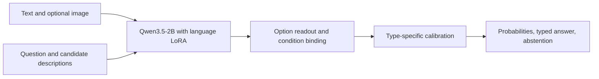

# Qwen3.5 Classification

**Dynamic decisions over text and images, built on Qwen3.5-2B.**

[Model on Hugging Face](https://huggingface.co/ken-jo/qwen3.5-classification) ·
[Dataset](https://huggingface.co/datasets/ken-jo/qwen3.5-classification-data) ·
[GitHub release](https://github.com/ken-jo/qwen3.5-classification/releases/tag/v0.1.0)

Provide evidence, a question and your own candidate descriptions. Qwen3.5 Classification returns a
probability distribution, a typed result and an abstention signal in one batched backbone
forward, with zero generated answer tokens.

This is the final research release of the Qwen-based Veyra experiments, now named
**qwen3.5-classification**. It uses **[Qwen/Qwen3.5-2B](https://huggingface.co/Qwen/Qwen3.5-2B)**,
learned language adapters, an option readout and a condition-modulated binding head.
The Qwen vision encoder is frozen. It is not a model trained from scratch or an
implementation of proprietary JEV weights.

## What you can ask

| Type | Request-specific definition | Output |
| --- | --- | --- |
| `choice` | 2-16 candidate descriptions | Candidate probabilities and selected label |
| `score` | 2-16 ordered level descriptions | Level probabilities and expected level |
| `noul` | A proposition, with true/false criteria | True/false probabilities |

Accepts text, one image, or both; 1-4 questions per request. Candidate meanings are supplied
at inference time. This does not imply reliable generalization to every unseen task.



## Measured scope

| Evaluation | Result | What it covers |
| --- | ---: | --- |
| Fresh procedural workflows | 69.38% | 1,440 questions, 480 groups, 3 authored families |
| Fresh CIFAR-10 photograph guard | 95.83% | 600 low-resolution image questions |
| Fresh SNLI | 87.78% | 450 questions |
| Fresh BANKING77 | 85.50% | 462 sampled eight-candidate questions, not standard 77-way classification |
| Official typed-decisions regression | 77.00% | 2,000 questions; 30.80% coverage under abstention |
| Resident local photo HTTP p95 | 114.94 ms | RTX 4060 Ti 8 GB; serial, one photo/question, six candidates |

The timing excludes loading, WAN transport and concurrency. It is not a general latency SLA.
On the shifted final population, accepted uncertain requests had **45.57% expected error**;
overall ECE was **12.58%**. Calibration does not guarantee correctness.

**Visual reasoning remains limited:** 0 of 72 exploratory 2048 games reached 2048.
A narrow balanced board-cell diagnostic scored 5/28 for images and 21/28 for text.
These failures are published alongside the successful measurements. Read the
[model card](MODEL_CARD.md) and [evaluation report](docs/EVALUATION.md) before using it.

## Run locally

Measured environment: Python 3.12, Windows, CUDA 12.8 wheels and RTX 4060 Ti 8 GB.
Other platforms and fresh dependency installation are not yet validated.

```sh
git clone https://github.com/ken-jo/qwen3.5-classification.git
cd qwen3.5-classification
uv sync --frozen
uv run qwen3.5-classification download
uv run python scripts/download_checkpoint.py
uv run qwen3.5-classification predict --checkpoint checkpoints/qwen3.5-classification --request examples/request.json
```

The primary checkpoint contains 32 MB of adaptation/readout tensors. The complete download
is about 243 MB, including historical acceptance evidence and intermediate adaptations;
the pinned Qwen backbone is downloaded separately. A custom runtime is required; loading
this adapter package with `AutoModel.from_pretrained` alone is not supported.

```python
from pathlib import Path
from qwen3_5_classification import DecisionRequest, QwenClassification

model = QwenClassification.load(Path("checkpoints/qwen3.5-classification"), local_files_only=True, merge=True)
request = DecisionRequest.from_json(Path("examples/request.json").read_text("utf-8"))
result = model.predict(request, Path("examples").resolve())
print(result["answers"])
```

The facade preserves the evaluated `veyra` Python modules and internal prompt markers.
The distribution is `qwen3.5-classification==0.1.0`; the frozen internal runtime identifies as `0.3.0a4`.
See [architecture and compatibility](docs/ARCHITECTURE.md).

## Playground and API

```sh
uv run python apps/playground/server.py --checkpoint checkpoints/qwen3.5-classification --host 127.0.0.1 --port 8765
```

Open `http://127.0.0.1:8765`. The inherited Korean playground includes sample photographs,
choice/score/noul presets, image-resolution comparisons, raw JSON and an exploratory 2048
demo. Its interface is retained; all public release documentation is in English.
For a trusted network, use `--host 0.0.0.0` and your PC's IP. The local playground has no
public multi-tenant authentication or per-user image isolation.

For the resident JSON API:

```sh
uv run qwen3.5-classification serve --checkpoint checkpoints/qwen3.5-classification --image-root examples --host 127.0.0.1 --port 8000
```

Send requests to `POST /v1/systemone`. Image paths are relative to the specified image root.
See [API details](docs/API.md) and [playground instructions](apps/playground/README.md).

## Data, evidence and attribution

- [Training and reproduction](docs/TRAINING.md): staged training, provenance and limits.
- [Dataset publication](docs/DATA.md): 15 historical corpus configurations, original splits,
  image hashes and source-specific licenses. Configurations overlap; do not concatenate them.
- [Research evidence](reports/README.md): successful and failed experiments.
- [Release history](CHANGELOG.md) and [future research](ROADMAP.md).

Code and adaptation weights: Apache-2.0. Qwen retains its upstream Apache-2.0 attribution.
Dataset licenses differ by source. LAYA and JEV inspired typed decision interfaces; their
weights and code are not included, and no affiliation or equivalent performance is claimed.
See [NOTICE](NOTICE) and [source licenses](docs/data-licenses/).

Maintainer: [ken-jo on GitHub](https://github.com/ken-jo) ·
[LinkedIn](https://www.linkedin.com/in/ik-chan-jo).
