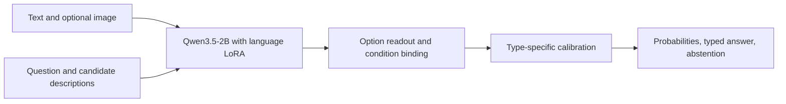

# QEV

**Your evidence. Your criteria. A decision with probabilities.**

[Model on Hugging Face](https://huggingface.co/ken-jo/qev) ·
[Dataset](https://huggingface.co/datasets/ken-jo/qev-data)

QEV is an open multimodal decision model **inspired by
[LAYA](https://huggingface.co/convaiinnovations/laya)** and built with the text and vision
backbone of **[Qwen3.5-2B](https://huggingface.co/Qwen/Qwen3.5-2B)**. Give it text, a photo,
or both, then describe the decision you need. It returns candidate probabilities, a typed
answer and an abstention signal in one batched backbone forward, with zero generated
answer tokens.

LAYA's request-defined typed decisions motivated the interface. QEV adds visual evidence
through Qwen's existing multimodal backbone, learned language adapters, option readouts
and a condition-modulated binding head. The Qwen vision encoder is frozen. LAYA weights
are not embedded in this checkpoint, and the current training recipe is supervised
adaptation with calibration. RLCD remains a research direction. QEV is independently
maintained; upstream model attribution is preserved.

## Decisions you define at request time

Route a support message, assess an ordered severity level, or ask whether a photo meets
a written condition. Change the candidate descriptions to change the task. The model
scores the choices supplied with the request; its output slots do not represent a fixed
catalog of classes.

These are intended uses for domain evaluation. Published results below establish the
current scope, including failures in visual reasoning and unfamiliar tasks.

## What you can ask

| Type | Request-specific definition | Output |
| --- | --- | --- |
| `choice` | 2-16 candidate descriptions | Candidate probabilities and selected label |
| `score` | 2-16 ordered level descriptions | Level probabilities and expected level |
| `noul` | A proposition, with true/false criteria | True/false probabilities |

Accepts text, one image, or both; 1-4 questions per request. Candidate meanings are supplied
at inference time. This does not imply reliable generalization to every unseen task.



## QEV and LAYA on the same inputs

| English test | LAYA English | LAYA Typed Decisions | QEV 0.1.1 |
| --- | ---: | ---: | ---: |
| Typed decisions, 2,000 questions | 36.05% | 76.95% | 77.00% |
| News topic, 400 examples | 95.00% | 95.25% | 82.50% |
| Emotion, 400 examples | 58.75% | 60.00% | 50.25% |


Typed-decisions is an adapted benchmark for QEV and the specialist. Their one-question
accuracy difference does not establish an advantage (paired 95% interval: -1.85 to +1.95
percentage points). News and emotion are **zero-shot relative to QEV's audited adaptation
data**; unknown backbone pretraining overlap remains possible. LAYA reports news in its
training mix and emotion held out. All models received the same inputs, without truncation.

LAYA is smaller and faster in this comparison. On typed-decisions, its specialist has
lower probability errors and 23.71 ms resident p50 versus QEV's 77.70 ms on the same GPU.
QEV adds image input; that capability has its own evaluations and limitations.
See [the full protocol, probability metrics and results](https://github.com/ken-jo/qev/blob/main/docs/LAYA_COMPARISON.md).

## Image and workflow evaluation

| Evaluation | Result | What it covers |
| --- | ---: | --- |
| Fresh procedural workflows | 69.38% | 1,440 questions, 480 groups, 3 authored families |
| Fresh CIFAR-10 photograph guard | 95.83% | 600 low-resolution image questions |
| Fresh SNLI | 87.78% | 450 questions |
| Fresh BANKING77 | 85.50% | 462 sampled eight-candidate questions, not standard 77-way classification |
| Official typed-decisions regression | 77.00% | 2,000 questions; 30.80% coverage under abstention |
| Resident local photo HTTP p95 | 114.94 ms | RTX 4060 Ti 8 GB; serial, one photo/question, six candidates |

The timing excludes loading, WAN transport and concurrency. It is not a general latency SLA.
On the shifted final population, accepted uncertain requests had **45.57% expected error**;
overall ECE was **12.58%**. Calibration does not guarantee correctness.

**Visual reasoning remains limited:** 0 of 72 exploratory 2048 games reached 2048.
A narrow balanced board-cell diagnostic scored 5/28 for images and 21/28 for text.
These failures are published alongside the successful measurements. Read the
[model card](https://github.com/ken-jo/qev/blob/main/MODEL_CARD.md) and [evaluation report](https://github.com/ken-jo/qev/blob/main/docs/EVALUATION.md) before using it.

## Run locally

Python package and command: **`qev`**. Python 3.12 is required.

```sh
python -m pip install https://huggingface.co/ken-jo/qev/resolve/main/runtime/qev-0.1.1-py3-none-any.whl
qev download --output checkpoints/qev
qev predict --checkpoint checkpoints/qev --request request.json
```

`qev download` retrieves the verified decision checkpoint and the pinned upstream
backbone. The Python package contains runtime code; model weights are downloaded
separately. See the [sample request](https://github.com/ken-jo/qev/blob/main/examples/request.json)
and [API schema](https://github.com/ken-jo/qev/blob/main/docs/API.md).
The runtime wheel is available with the model release. PyPI Trusted Publisher setup is
pending; `pip install qev` will become the shorter installation command once published.
See [publication status](https://github.com/ken-jo/qev/blob/main/release/pypi-publication.json).

Measured environment: Python 3.12, Windows, CUDA 12.8 wheels and RTX 4060 Ti 8 GB.
Other platforms and fresh dependency installation are not yet validated.

```sh
git clone https://github.com/ken-jo/qev.git
cd qev
uv sync --frozen
uv run qev download
uv run qev predict --checkpoint checkpoints/qev --request examples/request.json
```

The primary checkpoint contains 32 MB of adaptation/readout tensors. The complete download
is about 243 MB, including historical acceptance evidence and intermediate adaptations;
the pinned Qwen backbone is downloaded separately. A custom runtime is required; loading
this adapter package with `AutoModel.from_pretrained` alone is not supported.

```python
from pathlib import Path
from qev import DecisionRequest, QEV

model = QEV.load(Path("checkpoints/qev"), local_files_only=True, merge=True)
request = DecisionRequest.from_json(Path("examples/request.json").read_text("utf-8"))
result = model.predict(request, Path("examples").resolve())
print(result["answers"])
```

The facade preserves the evaluated `veyra` Python modules and internal prompt markers.
The distribution is `qev==0.1.1`; the frozen internal runtime identifies as `0.3.0a4`.
See [architecture and compatibility](https://github.com/ken-jo/qev/blob/main/docs/ARCHITECTURE.md).

## What you download

| Artifact | Hosted on | Purpose |
| --- | --- | --- |
| QEV adaptation and decision heads | Hugging Face `ken-jo/qev` | The learned QEV weights and calibration |
| Qwen3.5-2B backbone | Hugging Face `Qwen/Qwen3.5-2B` | The pinned upstream text and vision model |
| `qev` Python SDK | Release wheel; PyPI publication pending | Loading, typed inference, downloads and serving |
| Research and application source | GitHub `ken-jo/qev` | Training scripts, evaluations and local interfaces |

Installing the SDK installs code and dependencies. `qev download` fetches the two
weight components. The SDK's package size is not the model's size.

## Size and precision

The inference backbone has **2.213B parameters**. The checkpoint adds **7.992M stored
adapter/readout parameters** in a **32.01 MB safetensors file**. GPU inference uses a
BF16 backbone and FP32 decision readouts; the CPU path uses FP32. LoRA is merged into
the backbone for inference. Upstream weights download separately (about **4.55 GB**).
See [exact counts and tensor types](https://github.com/ken-jo/qev/blob/main/docs/MODEL_SIZE.md).

## Playground and API

The existing interfaces are available for local use. Public Hugging Face Space creation
was cancelled; no hosted demo is advertised. The [English Gradio interface](https://github.com/ken-jo/qev/blob/main/apps/hf_space/README.md)
includes editable text/image examples, six sample photos and choice/score/noul decisions.
See [local playground details](https://github.com/ken-jo/qev/blob/main/docs/PLAYGROUND.md).

```sh
uv run python apps/playground/server.py --checkpoint checkpoints/qev --host 127.0.0.1 --port 8765
```

Open `http://127.0.0.1:8765`. The inherited Korean playground includes sample photographs,
choice/score/noul presets, image-resolution comparisons, raw JSON and an exploratory 2048
demo. Its interface is retained; all public release documentation is in English.
For a trusted network, use `--host 0.0.0.0` and your PC's IP. The local playground has no
public multi-tenant authentication or per-user image isolation.

For the resident JSON API:

```sh
uv run qev serve --checkpoint checkpoints/qev --image-root examples --host 127.0.0.1 --port 8000
```

Send requests to `POST /v1/systemone`. Image paths are relative to the specified image root.
See [API details](https://github.com/ken-jo/qev/blob/main/docs/API.md) and [playground instructions](https://github.com/ken-jo/qev/blob/main/apps/playground/README.md).

## Data, evidence and attribution

- [Training and reproduction](https://github.com/ken-jo/qev/blob/main/docs/TRAINING.md): staged training, provenance and limits.
- [Dataset publication](https://github.com/ken-jo/qev/blob/main/docs/DATA.md): 15 historical corpus configurations, original splits,
  image hashes and source-specific licenses. Configurations overlap; do not concatenate them.
- [Research evidence](https://github.com/ken-jo/qev/blob/main/reports/README.md): successful and failed experiments.
- [Release history](https://github.com/ken-jo/qev/blob/main/CHANGELOG.md) and [future research](https://github.com/ken-jo/qev/blob/main/ROADMAP.md).

Code and adaptation weights: Apache-2.0. Qwen retains its upstream Apache-2.0 attribution.
Dataset licenses differ by source. LAYA and JEV inspired typed decision interfaces; their
weights and code are not included, and no affiliation or equivalent performance is claimed.
See [NOTICE](https://github.com/ken-jo/qev/blob/main/NOTICE) and [source licenses](https://github.com/ken-jo/qev/blob/main/docs/data-licenses/).

[GitHub: ken-jo/qev](https://github.com/ken-jo/qev)
