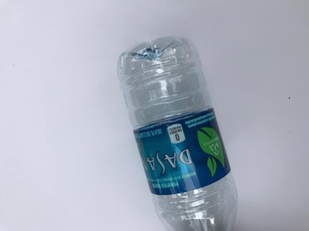

# One photograph, three typed decisions

This example is the existing release verification photograph, published with its actual
recorded probabilities. It was the first sorted test photograph used by the package
verification script, before this introduction was written. It is a previously inspected
fixture, not a new held-out accuracy estimate.



## Run

From the source repository, after installing the QEV runtime and downloading the pinned
model as described in the main README:

```sh
qev predict --checkpoint checkpoints/qev --request examples/photograph/request.json
```

The image path resolves relative to `request.json`. The request combines all three types;
the released runtime batches them into one backbone forward. Compare the output with
`response.json`. GPU precision and library changes may affect floating-point values.

## Read the response

| Type | Recorded interpretation |
| --- | --- |
| `choice` | `c4` means plastic in this request; its probability is 0.936123. |
| `score` | Band 0 means glass/plastic, band 1 metal/trash, band 2 cardboard/paper. The expected zero-based level is 0.425389; the most likely band is 0 with probability 0.697841. |
| `noul` | The proposition is membership in glass, paper or plastic. Probability true is 0.790313. |

All three returned `abstained: false`. The full response retains every candidate
probability and the legacy internal model identifier. QEV's package branding does not
change these verified inference outputs.

## Source and integrity

- Image: TrashNet, copyright (c) 2017 Gary Thung, MIT; full notice in `LICENSE.txt`.
- Original project: https://github.com/garythung/trashnet
- Downloaded source: https://www.kaggle.com/datasets/vminhkhoi/trashnet, version 1.
- The original image bytes, state text and three typed question definitions are unchanged.
- `provenance.json` records the source rows, hashes and verification scope.
- `response.json` comes from `release/model-inference.json` in this repository.

`c0` through `c5` are request-local identifiers. Their meanings are supplied in the
candidate descriptions; they are not a permanent material taxonomy in the model.
